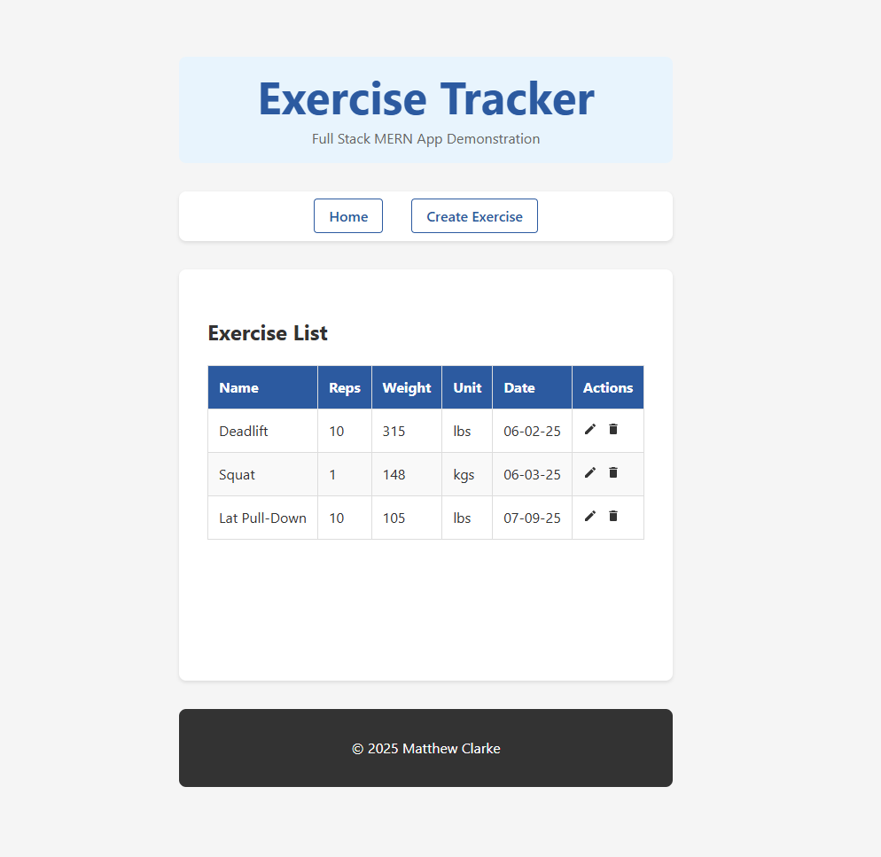
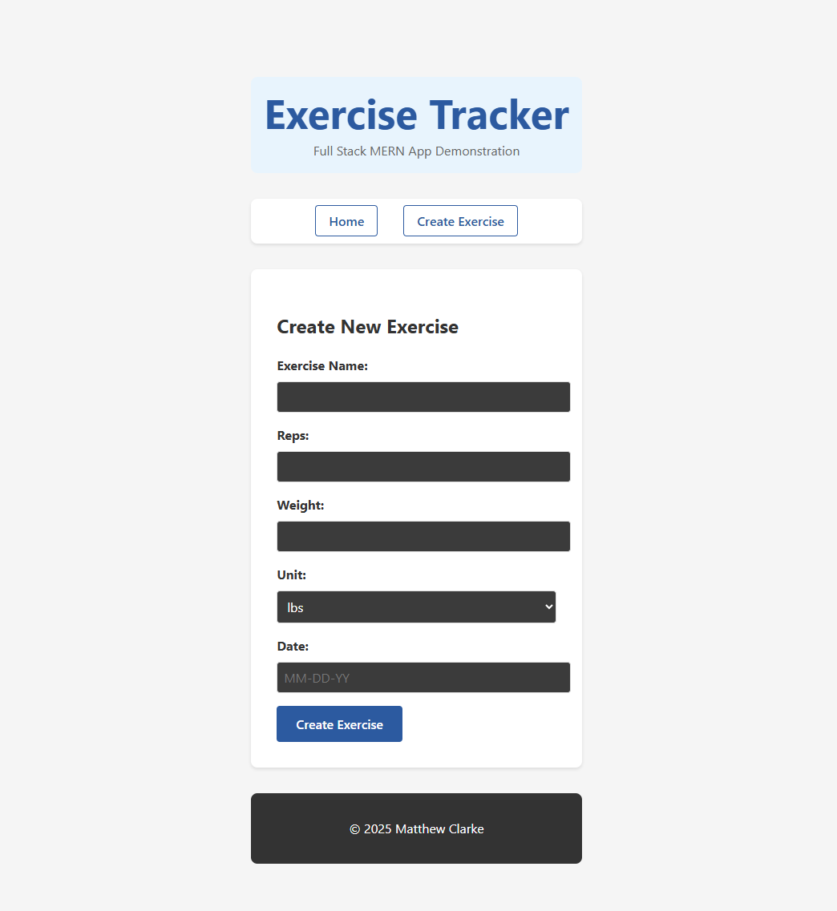

# Exercise Tracker

A full-stack MERN application for tracking personal fitness exercises with complete CRUD functionality.

## Overview

This project demonstrates modern web development practices using the MERN stack (MongoDB, Express.js, React, Node.js) to create a responsive single-page application for exercise tracking.

**Key Features:**
- Complete CRUD operations for exercise management
- RESTful API with proper HTTP status codes
- Responsive React frontend with client-side routing
- MongoDB database integration
- Form validation and error handling

## Screenshots



## Tech Stack

**Frontend:**
- React 18 with functional components and hooks
- React Router DOM for navigation
- Vite for build tooling
- Custom CSS with responsive design

**Backend:**
- Node.js with Express.js framework
- MongoDB with Mongoose ODM
- RESTful API architecture
- ES6+ modules with async/await

## Skills Demonstrated

### Frontend Development
- React functional components with hooks (useState, useEffect, useNavigate)
- Client-side routing and navigation
- State management and component communication
- Form handling and validation
- Responsive CSS design

### Backend Development
- RESTful API design and implementation
- Express.js middleware and routing
- MongoDB database operations with Mongoose
- Input validation and error handling
- Environment-based configuration

### Full-Stack Integration
- CORS configuration and proxy setup
- HTTP client with Fetch API
- Async/await for promise handling
- End-to-end data flow management
  
## Getting Started

### Prerequisites
- Node.js (v14+)
- MongoDB (local or Atlas)
- npm

### Installation

1. Clone the repository
```bash
git clone https://github.com/mmfclarke/mern-exercise-tracker.git
cd full-stack-mern-exercise-app
```

2. Backend setup
```bash
cd backend
npm install
# Add your MongoDB connection string to .env
npm start
```

3. Frontend setup
```bash
cd frontend
npm install
npm run dev
```

4. Open http://localhost:5173

### Environment Variables

Create `.env` in the backend directory:
```
PORT=3000
MONGODB_CONNECT_STRING=your_mongodb_connection_string
```

## API Endpoints

| Method | Endpoint | Description |
|--------|----------|-------------|
| GET | `/exercises` | Get all exercises |
| GET | `/exercises/:id` | Get exercise by ID |
| POST | `/exercises` | Create new exercise |
| PUT | `/exercises/:id` | Update exercise |
| DELETE | `/exercises/:id` | Delete exercise |

## Project Structure

```
├── backend/
│   ├── exercises_controller.mjs    # Route handlers
│   ├── exercises_model.mjs         # Database operations
│   └── .env                        # Environment config
├── frontend/
│   ├── src/
│   │   ├── components/            # Reusable components
│   │   ├── pages/                 # Page components
│   │   └── App.jsx                # Main app component
│   └── package.json
└── README.md
```

## Data Model

Each exercise contains:
- **name** (String) - Exercise name
- **reps** (Number) - Number of repetitions  
- **weight** (Number) - Weight used
- **unit** (String) - Weight unit (kgs/lbs)
- **date** (String) - Date performed (MM-DD-YY format)

## Future Enhancements

- [ ] User authentication
- [ ] Exercise categories
- [ ] Progress tracking charts
- [ ] Export functionality
- [ ] Mobile app version

## About This Project
This application was built as part of a full-stack web development course to 
demonstrate proficiency with the MERN stack and modern web development practices.

## Contact

Matthew Clarke - mmfclarke1@gmail.com

Project Link: [https://github.com/mmfclarke/mern-exercise-tracker](https://github.com/mmfclarke/mern-exercise-tracker)
